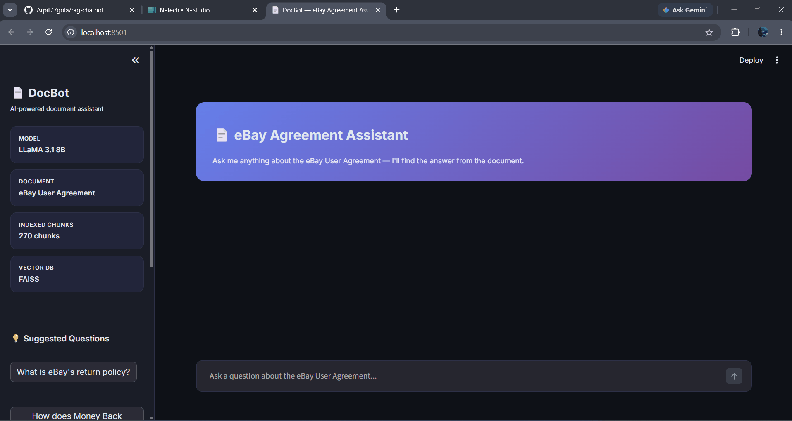

# DocBot — RAG-Based Document QA Chatbot

A conversational AI chatbot that answers questions based on the eBay User Agreement document. Built using a Retrieval-Augmented Generation (RAG) pipeline with a real-time streaming interface.

---

## What I Built

I wanted to build something that could actually read a legal document and answer questions about it — not just keyword search, but proper semantic understanding. The idea was simple: chunk the document, embed it, store in a vector database, and when a user asks something, find the most relevant chunks and pass them to an LLM to generate a grounded answer.

The whole pipeline runs locally (except the LLM inference which goes through Groq), and the interface is built in Streamlit with real-time streaming so you can see the answer being generated token by token.

---

## Tech Stack

| Component | Tool Used |
|-----------|-----------|
| Embeddings | all-MiniLM-L6-v2 (sentence-transformers) |
| Vector Database | FAISS |
| LLM | LLaMA 3.1 8B via Groq API |
| UI | Streamlit |
| PDF Parsing | PyPDF |
| Chunking | LangChain RecursiveCharacterTextSplitter |

---

## Project Structure

rag_chatbot/
├── data/                   # Input PDF document
├── chunks/                 # Processed text chunks (generated)
├── vectordb/               # FAISS index and embeddings (generated)
├── notebooks/
│   └── preprocessing.ipynb # Walkthrough of preprocessing and evaluation
├── src/
│   ├── ingest.py           # PDF loading, chunking, embedding, FAISS indexing
│   ├── retriever.py        # Semantic search over vector DB
│   └── generator.py        # LLM response generation with streaming
├── app.py                  # Streamlit chatbot UI
├── requirements.txt
└── README.md

---

## How It Works

1. The PDF is loaded and cleaned using PyPDF
2. Text is split into 300-character chunks with 50-character overlap using sentence-aware splitting
3. Each chunk is embedded using `all-MiniLM-L6-v2` and stored in a FAISS index
4. When a user asks a question, the query is embedded and top 3 similar chunks are retrieved
5. The retrieved chunks + user query are injected into a prompt and sent to LLaMA 3.1 8B
6. The response streams back token by token into the Streamlit UI

---

## Setup & Installation

### 1. Clone the repository
```bash
git clone https://github.com/Arpit77gola/rag-chatbot.git
cd rag-chatbot
```

### 2. Install dependencies
```bash
pip install -r requirements.txt
```

### 3. Add your Groq API key
Create a `.env` file in the root folder:


Get your free API key from https://console.groq.com

### 4. Add your document
Place your PDF in the `data/` folder and name it `document.pdf`

### 5. Process the document
```bash
python src/ingest.py
```
This will create the FAISS index and save all chunks.

### 6. Run the chatbot
```bash
streamlit run app.py
```
Open `http://localhost:8501` in your browser.

---

## Sample Queries

- "What is eBay's return policy?"
- "How does the eBay Money Back Guarantee work?"
- "What is the arbitration process?"
- "Can I sell vehicles on eBay?"
- "What happens if I don't pay for an item?"

---

## Demo



**GitHub Repository:** https://github.com/Arpit77gola/rag-chatbot

---

## Model & Embedding Choices

I chose `all-MiniLM-L6-v2` because it strikes a good balance between speed and accuracy for semantic search. It produces 384-dimensional embeddings and works well for retrieval tasks without needing a GPU.

For the LLM, I went with LLaMA 3.1 8B via Groq because running a 7B+ model locally would be too slow for a demo. Groq gives near-instant inference with streaming support, which makes the chatbot feel responsive.

FAISS was the natural choice for the vector DB — no server to set up, works entirely on disk, and fast enough for this document size.

